# Gym Membership Management System - Technical Design Specification

This document provides the complete, production-ready technical design, visual style guidelines, database schema, routing structure, and API architecture for implementing the Gym Membership Management System.

---

## 1. Visual Design & Glassmorphic UI System

To achieve a modern, premium, and futuristic look, the application utilizes a **Glassmorphic Dark Mode design system** (`glassmorphism`) mixed with vivid neon accents. The visual engine relies on translucent layers, high-contrast borders, frosted background blurs, and glowing shadows.

### 1.1 Color Palette (CSS Custom Properties)
Insert the following variables into `src/app/globals.css` or the main styling sheet:

```css
@layer base {
  :root {
    /* Base Obsidian Theme */
    --background: 240 10% 3.9%;
    --foreground: 0 0% 98%;
    
    /* Card Glass Settings */
    --glass-background: rgba(17, 17, 21, 0.6);
    --glass-border: rgba(255, 255, 255, 0.08);
    --glass-border-hover: rgba(255, 255, 255, 0.16);
    --glass-blur: 16px;
    
    /* Neon Accents (HSL) */
    --primary: 263.4 90% 50.4%;          /* Vivid Purple Neon */
    --primary-glow: rgba(124, 58, 237, 0.3);
    
    --secondary: 191.6 91.4% 36.5%;     /* Electric Cyan */
    --secondary-glow: rgba(14, 116, 144, 0.3);
    
    --accent-emerald: 142.1 76.2% 36.3%; /* Acid Emerald for Success/Active */
    --accent-rose: 346.8 77.2% 49.8%;    /* Neon Rose for Alerts/Expired */
    --accent-amber: 47.9 95.8% 51.2%;   /* Amber for Pending/Renewals */

    /* Typography Defaults */
    --font-sans: 'Outfit', 'Inter', system-ui, sans-serif;
  }
}
```

### 1.2 Glassmorphic Utility Classes (Tailwind CSS Extended Configuration)
Add the following classes to Tailwind's utility configurations or define them as custom classes:

```css
/* Glass Card styling */
.glass-panel {
  background: var(--glass-background);
  backdrop-filter: blur(var(--glass-blur));
  -webkit-backdrop-filter: blur(var(--glass-blur));
  border: 1px solid var(--glass-border);
  box-shadow: 0 8px 32px 0 rgba(0, 0, 0, 0.37);
  transition: border-color 0.3s ease, box-shadow 0.3s ease;
}

.glass-panel-hover:hover {
  border-color: var(--glass-border-hover);
  box-shadow: 0 12px 40px 0 rgba(0, 0, 0, 0.5), 0 0 15px var(--primary-glow);
}

/* Glass Inputs & Selects */
.glass-input {
  background: rgba(255, 255, 255, 0.03);
  border: 1px solid rgba(255, 255, 255, 0.1);
  color: #fff;
  border-radius: 8px;
  backdrop-filter: blur(8px);
  transition: all 0.3s cubic-bezier(0.4, 0, 0.2, 1);
}

.glass-input:focus {
  border-color: hsl(var(--primary));
  box-shadow: 0 0 10px var(--primary-glow);
  outline: none;
}

/* Scrollbar customization */
::-webkit-scrollbar {
  width: 6px;
  height: 6px;
}
::-webkit-scrollbar-track {
  background: transparent;
}
::-webkit-scrollbar-thumb {
  background: rgba(255, 255, 255, 0.1);
  border-radius: 10px;
}
::-webkit-scrollbar-thumb:hover {
  background: hsl(var(--primary));
}
```

### 1.3 Framer Motion Presets for Animations
Standardize dynamic animations across views using these React wrapper configurations:

```typescript
// Fade-in & Scale-up layout container
export const pageTransition = {
  initial: { opacity: 0, scale: 0.98, y: 10 },
  animate: { opacity: 1, scale: 1, y: 0, transition: { duration: 0.4, ease: [0.16, 1, 0.3, 1] } },
  exit: { opacity: 0, scale: 0.98, y: -10, transition: { duration: 0.2 } }
};

// Staggered list items load
export const listContainer = {
  hidden: { opacity: 0 },
  show: {
    opacity: 1,
    transition: {
      staggerChildren: 0.05
    }
  }
};

export const listItem = {
  hidden: { opacity: 0, x: -10, scale: 0.95 },
  show: { opacity: 1, x: 0, scale: 1, transition: { type: "spring", stiffness: 100, damping: 15 } }
};

// Micro-interactions (Buttons / Cards Hover)
export const interactiveHover = {
  whileHover: { scale: 1.02, y: -2, transition: { duration: 0.2 } },
  whileTap: { scale: 0.98 }
};
```

### 1.4 Glassmorphic Recharts Dashboard Charts
Charts should be customized to show gradients under lines, neon dots, and custom tooltip panels.

*   **Line Chart Gradient Customization:**
    ```jsx
    <defs>
      <linearGradient id="revenueGrad" x1="0" y1="0" x2="0" y2="1">
        <stop offset="5%" stopColor="hsl(var(--primary))" stopOpacity={0.4}/>
        <stop offset="95%" stopColor="hsl(var(--primary))" stopOpacity={0.0}/>
      </linearGradient>
      <linearGradient id="attendanceGrad" x1="0" y1="0" x2="0" y2="1">
        <stop offset="5%" stopColor="hsl(var(--secondary))" stopOpacity={0.4}/>
        <stop offset="95%" stopColor="hsl(var(--secondary))" stopOpacity={0.0}/>
      </linearGradient>
    </defs>
    ```
*   **Custom Glass Tooltip Component:**
    ```jsx
    const CustomGlassTooltip = ({ active, payload, label }) => {
      if (active && payload && payload.length) {
        return (
          <div className="glass-panel p-3 border border-white/10 rounded-lg shadow-2xl backdrop-blur-md">
            <p className="text-white/60 text-xs mb-1 font-semibold">{label}</p>
            {payload.map((entry, index) => (
              <p key={index} className="text-sm font-bold" style={{ color: entry.color }}>
                {entry.name}: {entry.value}
              </p>
            ))}
          </div>
        );
      }
      return null;
    };
    ```

---

## 2. Frontend Routes & Page layouts (Next.js 15 App Router)

The structure manages clean separations of concerns using Next.js route groups `(dashboard)` for authenticated portals.

```
src/
└── app/
    ├── layout.tsx                # Context providers (Auth, Theme, Query, Toast)
    ├── page.tsx                  # Landing page & Portal Selector (Premium CSS details)
    ├── login/
    │   └── page.tsx              # Glassmorphic Login card with selection of Role Mock login
    ├── (dashboard)/
    │   ├── layout.tsx            # Shell with dynamic sidebar based on RBAC and user role
    │   │                         
    │   ├── admin/                # Role: ADMIN / OWNER & SUPER ADMIN
    │   │   ├── page.tsx          # Main Admin Dashboard (Stats, Revenue Recharts, Activity logs)
    │   │   ├── members/
    │   │   │   ├── page.tsx      # Member Listing Grid with dynamic search & filter controls
    │   │   │   ├── new/
    │   │   │   │   └── page.tsx  # Add Member form (Image capture, QR Generation, initial stats)
    │   │   │   └── [id]/
    │   │   │       └── page.tsx  # Member Profile, assign plan, update status, details
    │   │   ├── memberships/
    │   │   │   └── page.tsx      # Plan Management page (Standard, Custom, duration configurations)
    │   │   ├── payments/
    │   │   │   └── page.tsx      # Payment ledger, mock manual billing form, receipt view
    │   │   ├── scan/
    │   │   │   └── page.tsx      # QR Code Scanner Scanner (Uses html5-qrcode API validator overlay)
    │   │   └── reports/
    │   │       └── page.tsx      # Interactive Export Module (CSV/PDF downloads for Revenue, Attendance)
    │   │
    │   ├── trainer/              # Role: TRAINER
    │   │   ├── page.tsx          # Trainer Dashboard (Assigned members list, fast update actions)
    │   │   ├── members/
    │   │   │   └── [id]/
    │   │   │       ├── measurements/page.tsx # Height, weight, body fat tracking charts
    │   │   │       ├── workouts/page.tsx     # Drag-and-drop schedule/editor for workout routines
    │   │   │       └── diet/page.tsx         # Macro planner (Protein, Carbs, Fats, Water log helper)
    │   │
    │   └── member/               # Role: MEMBER
    │       ├── page.tsx          # Member Home (Quick view check-in QR Code, upcoming workout, diet checklist)
    │       ├── progress/
    │       │   └── page.tsx      # Personal analytics dashboard (Progress graphs, BMI tracker)
    │       ├── workouts/
    │       │   └── page.tsx      # Active Workout log interface (Checklist with video previews)
    │       ├── diet/
    │       │   └── page.tsx      # Diet timeline with water intake tracker
    │       └── invoices/
    │           └── page.tsx      # Payment history & Invoice receipt generation (PDF export)
```

---

## 3. Database Schema (Prisma ORM & PostgreSQL)

The schema defines models mapping users, sub-roles, memberships, financial details, metrics logs, plans, and notifications. Place this file in `prisma/schema.prisma`.

```prisma
datasource db {
  provider  = "postgresql"
  url       = env("DATABASE_URL") // Supabase connection string
  directUrl = env("DIRECT_URL")   // Direct connection pool bypass
}

generator client {
  provider = "prisma-client-js"
}

enum UserRole {
  SUPER_ADMIN
  ADMIN
  TRAINER
  MEMBER
}

enum Gender {
  MALE
  FEMALE
  OTHER
}

enum PaymentStatus {
  PAID
  PENDING
  PARTIAL
  REFUNDED
}

enum PaymentMethod {
  CASH
  UPI
  CARD
  BANK_TRANSFER
}

enum PlanDuration {
  MONTHLY
  QUARTERLY
  SEMI_ANNUAL
  ANNUAL
  CUSTOM
}

enum MembershipStatus {
  ACTIVE
  EXPIRED
  FROZEN
  CANCELLED
}

model User {
  id           String      @id @default(uuid())
  email        String      @unique
  passwordHash String
  role         UserRole
  createdAt    DateTime    @default(now())
  updatedAt    DateTime    @updatedAt
  
  // Relations depending on Role
  adminProfile   Admin?
  trainerProfile Trainer?
  memberProfile  Member?

  @@index([email])
}

model Admin {
  id        String   @id @default(uuid())
  userId    String   @unique
  user      User     @relation(fields: [userId], references: [id], onDelete: Cascade)
  name      String
  phone     String?
  gymName   String   @default("Core Fit Club")
  createdAt DateTime @default(now())
  updatedAt DateTime @updatedAt
}

model Trainer {
  id           String               @id @default(uuid())
  userId       String               @unique
  user         User                 @relation(fields: [userId], references: [id], onDelete: Cascade)
  name         String
  phone        String
  specialty    String?
  bio          String?
  avatarUrl    String?
  createdAt    DateTime             @default(now())
  updatedAt    DateTime             @updatedAt
  
  // Relations
  members      Member[]             @relation("TrainerToMember")
  workouts     WorkoutPlan[]
  diets        DietPlan[]
}

model Member {
  id               String            @id @default(uuid())
  userId           String            @unique
  user             User              @relation(fields: [userId], references: [id], onDelete: Cascade)
  memberId         String            @unique // Auto-generated human-readable ID e.g., CF-2026-0001
  name             String
  phone            String
  dob              DateTime
  gender           Gender
  emergencyContact String
  avatarUrl        String?
  idProofUrl       String?
  qrCodeToken      String            @unique // Unique cryptographic string encoded in QR
  
  // Physical measurements
  initialHeight    Float             // in cm
  initialWeight    Float             // in kg
  
  // Relations
  trainerId        String?
  trainer          Trainer?          @relation("TrainerToMember", fields: [trainerId], references: [id], onDelete: SetNull)
  membershipId     String?           @unique
  membership       Membership?       @relation(fields: [membershipId], references: [id])
  
  attendanceLogs   Attendance[]
  payments         Payment[]
  bodyMeasurements BodyMeasurement[]
  workoutLogs      WorkoutProgress[]
  dietLogs         DietLog[]

  createdAt        DateTime          @default(now())
  updatedAt        DateTime          @updatedAt

  @@index([qrCodeToken])
  @@index([memberId])
}

model MembershipPlan {
  id          String         @id @default(uuid())
  name        String         @unique // e.g. "Gold Annual Package"
  price       Float
  duration    PlanDuration
  durationDays Int           // Exact days duration (e.g. 30, 90, 180, 365)
  joiningFee  Float          @default(0)
  gstPercent  Float          @default(18.0) // GST standard
  freezeDays  Int            @default(0)
  description String?
  isActive    Boolean        @default(true)
  
  memberships Membership[]
  createdAt   DateTime       @default(now())
  updatedAt   DateTime       @updatedAt
}

model Membership {
  id            String           @id @default(uuid())
  planId        String
  plan          MembershipPlan   @relation(fields: [planId], references: [id])
  startDate     DateTime
  endDate       DateTime
  status        MembershipStatus @default(ACTIVE)
  freezeStart   DateTime?
  freezeEnd     DateTime?
  remainingFreezeDays Int
  
  member        Member?
  createdAt     DateTime         @default(now())
  updatedAt     DateTime         @updatedAt
}

model Payment {
  id            String        @id @default(uuid())
  memberId      String
  member        Member        @relation(fields: [memberId], references: [id], onDelete: Cascade)
  invoiceNumber String        @unique // Format: INV-2026-XXXX
  amountPaid    Float
  totalAmount   Float         // Invoiced base + GST
  taxAmount     Float         // GST value
  paymentDate   DateTime      @default(now())
  status        PaymentStatus @default(PAID)
  method        PaymentMethod
  notes         String?
  
  createdAt     DateTime      @default(now())
}

model Attendance {
  id         String   @id @default(uuid())
  memberId   String
  member     Member   @relation(fields: [memberId], references: [id], onDelete: Cascade)
  checkInTime DateTime @default(now())
  status     String   @default("VALID") // VALID, EXPIRED_PLAN, DUPLICATE
  
  createdAt  DateTime @default(now())

  @@index([memberId, checkInTime])
}

model BodyMeasurement {
  id        String   @id @default(uuid())
  memberId  String
  member    Member   @relation(fields: [memberId], references: [id], onDelete: Cascade)
  logDate   DateTime @default(now())
  
  weight    Float    // kg
  height    Float    // cm
  bmi       Float    // calculated
  bodyFat   Float?   // %
  chest     Float?   // inches
  waist     Float?   // inches
  hip       Float?   // inches
  biceps    Float?   // inches
  thigh     Float?   // inches
  notes     String?
  
  createdAt DateTime @default(now())
}

model WorkoutPlan {
  id          String              @id @default(uuid())
  trainerId   String
  trainer     Trainer             @relation(fields: [trainerId], references: [id], onDelete: Cascade)
  title       String              // e.g. "Intermediate Push Routine"
  description String?
  
  exercises   WorkoutExercise[]   // JSON array or child table relations
  assignments WorkoutAssignment[]
  createdAt   DateTime            @default(now())
  updatedAt   DateTime            @updatedAt
}

model WorkoutExercise {
  id            String      @id @default(uuid())
  workoutPlanId String
  workoutPlan   WorkoutPlan @relation(fields: [workoutPlanId], references: [id], onDelete: Cascade)
  exerciseName  String
  sets          Int
  reps          Int
  targetWeight  Float?      // Target weight in kg
  videoUrl      String?     // Form demonstration video
  notes         String?
}

model WorkoutAssignment {
  id            String            @id @default(uuid())
  workoutPlanId String
  workoutPlan   WorkoutPlan       @relation(fields: [workoutPlanId], references: [id], onDelete: Cascade)
  memberId      String
  assignedDate  DateTime          @default(now())
  isActive      Boolean           @default(true)
  
  progressLogs  WorkoutProgress[]
}

model WorkoutProgress {
  id           String            @id @default(uuid())
  memberId     String
  member       Member            @relation(fields: [memberId], references: [id], onDelete: Cascade)
  assignmentId String
  assignment   WorkoutAssignment @relation(fields: [assignmentId], references: [id], onDelete: Cascade)
  logDate      DateTime          @default(now())
  completed    Boolean           @default(false)
  feedback     String?           // How the member felt during workout
}

model DietPlan {
  id          String   @id @default(uuid())
  trainerId   String
  trainer     Trainer  @relation(fields: [trainerId], references: [id], onDelete: Cascade)
  title       String
  
  breakfast   String   // Text instruction
  lunch       String
  dinner      String
  snacks      String?
  
  targetCalories Float @default(2000)
  targetProtein  Float @default(120) // in grams
  targetCarbs    Float @default(200) // in grams
  targetFats     Float @default(60)  // in grams
  targetWaterMl  Float @default(3000)

  createdAt   DateTime @default(now())
  updatedAt   DateTime @updatedAt
  
  logs        DietLog[]
}

model DietLog {
  id            String   @id @default(uuid())
  memberId      String
  member        Member   @relation(fields: [memberId], references: [id], onDelete: Cascade)
  dietPlanId    String
  dietPlan      DietPlan @relation(fields: [dietPlanId], references: [id], onDelete: Cascade)
  logDate       DateTime @default(now())
  waterIntakeMl Float    @default(0)
  caloriesLog   Float    @default(0)
  proteinLog    Float    @default(0)
}

model Notification {
  id        String   @id @default(uuid())
  recipientId String // references User.id
  title     String
  message   String
  isRead    Boolean  @default(false)
  sentAt    DateTime @default(now())
}
```

---

## 4. Backend API Design (Express.js)

The backend provides JWT validation and checks database relationships with Prisma.

### 4.1 Authentication & RBAC Middleware
All protected backend queries rely on verifying JWT tokens and comparing authorization claims.

```javascript
// middleware/auth.js
const jwt = require('jsonwebtoken');
const { PrismaClient } = require('@prisma/client');
const prisma = new PrismaClient();

const authenticateJWT = (req, res, next) => {
  const authHeader = req.headers.authorization;
  if (!authHeader || !authHeader.startsWith('Bearer ')) {
    return res.status(401).json({ error: 'Access token required' });
  }

  const token = authHeader.split(' ')[1];
  try {
    const decoded = jwt.verify(token, process.env.JWT_SECRET);
    req.user = decoded; // { id, email, role }
    next();
  } catch (error) {
    return res.status(403).json({ error: 'Invalid or expired token' });
  }
};

const requireRole = (allowedRoles) => {
  return (req, res, next) => {
    if (!req.user || !allowedRoles.includes(req.user.role)) {
      return res.status(403).json({ error: 'Permission denied for this operation' });
    }
    next();
  };
};

module.exports = { authenticateJWT, requireRole };
```

### 4.2 Endpoint Manifest

#### Authentication Module (`/api/auth`)
*   `POST /login`
    *   **Body:** `{ email, password }`
    *   **Response (200):** `{ token, role, user: { id, email, name } }`
*   `GET /me`
    *   **Headers:** `Bearer <Token>`
    *   **Response (200):** Details of active user depending on sub-profile mapping.

#### Member Management (`/api/admin/members`)
*   `POST /` (Requires: `ADMIN`, `SUPER_ADMIN`)
    *   **Body:** `{ email, name, phone, dob, gender, emergencyContact, height, weight, trainerId, planId }`
    *   **Behavior:** Hashes default password, creates `User`, `Member`, and `Membership` inside a Prisma Transaction, auto-generates sequential `memberId`, and issues cryptographic `qrCodeToken`.
*   `GET /` (Requires: `ADMIN`, `SUPER_ADMIN`, `TRAINER`)
    *   **Query:** `?search=String&status=ACTIVE|EXPIRED&page=1`
    *   **Response:** Paginated array of members with relations.
*   `GET /:id` (Requires: authenticated users linked to profile or management)
    *   **Response:** Detailed member schema block including active membership details, trainer info, and latest metrics.
*   `PUT /:id` (Requires: `ADMIN`, `SUPER_ADMIN`)
    *   **Body:** Member update profile variables.

#### Membership Plan Configurator (`/api/admin/membership-plans`)
*   `POST /` | `GET /` | `PUT /:id` (Write operations require `ADMIN`, `SUPER_ADMIN`)
    *   **Payload Format:** `{ name, price, duration, durationDays, joiningFee, gstPercent, freezeDays, description }`

#### Attendance Module (`/api/attendance`)
*   `POST /scan` (Requires: `ADMIN`, `SUPER_ADMIN`)
    *   **Body:** `{ qrCodeToken }`
    *   **Check logic:** Locates token matching member, checks if active membership matches current date, verifies payment status, updates dynamic logs.
    *   **Response (200 - Valid):** `{ success: true, memberName: "Jane Doe", status: "VALID", activePlan: "Gold Plan", expires: "2026-12-31" }`
    *   **Response (400 - Expired/Invalid):** `{ success: false, reason: "Membership Expired/Unpaid", status: "DENIED" }`
*   `GET /logs` (Requires: `ADMIN`, `SUPER_ADMIN`, `TRAINER`)
    *   **Query:** `?memberId=String&startDate=ISO&endDate=ISO`
    *   **Response:** Flat array of verified attendance rows.

#### Financials & Payments (`/api/payments`)
*   `POST /invoice` (Requires: `ADMIN`, `SUPER_ADMIN`)
    *   **Body:** `{ memberId, planId, amountPaid, method, totalAmount, notes }`
    *   **Behavior:** Creates payment records, updates invoice ledger, updates membership statuses.
*   `GET /ledger` (Requires: `ADMIN`, `SUPER_ADMIN`)
    *   **Response:** Revenue trends and transaction logs for financial Recharts panels.

#### Metrics & Plans (Trainer/Member) (`/api/fitness`)
*   `POST /measurements` (Requires: `TRAINER`)
    *   **Body:** `{ memberId, weight, height, bodyFat, chest, waist, biceps, thigh, notes }`
    *   **Behavior:** Saves entry, auto-calculates BMI: `weight / (height/100)^2`
*   `POST /workouts` & `POST /diets` (Requires: `TRAINER`)
    *   **Body:** Custom objects schema mappings based on Prisma assignments structures.
*   `GET /progress/:memberId` (Requires: Linked member / trainer / admin)
    *   **Response:** Historical logs of metrics for rendering visual progress lines in Recharts.

---

## 5. Front-End Core Component Visual Implementation

Below are the exact frontend component guidelines for generating modern, high-fidelity visual representations of key modules.

### 5.1 Glassmorphic Shell Layout Component
Implements global side nav rendering visual effects, gradients, and backdrop filters.

```tsx
// src/components/DashboardShell.tsx
"use client";

import React from 'react';
import { motion } from 'framer-motion';
import Link from 'next/link';
import { usePathname } from 'next/navigation';
import { 
  Dumbbell, Users, CreditCard, Calendar, BarChart3, Settings, LogOut, QrCode
} from 'lucide-react';

interface SidebarItem {
  name: string;
  href: string;
  icon: React.ComponentType<any>;
}

const sidebarConfig: Record<string, SidebarItem[]> = {
  ADMIN: [
    { name: 'Analytics', href: '/admin', icon: BarChart3 },
    { name: 'Members', href: '/admin/members', icon: Users },
    { name: 'Plans', href: '/admin/memberships', icon: Dumbbell },
    { name: 'Payments', href: '/admin/payments', icon: CreditCard },
    { name: 'Scan Check-In', href: '/admin/scan', icon: QrCode },
  ],
  TRAINER: [
    { name: 'Dashboard', href: '/trainer', icon: Users },
  ],
  MEMBER: [
    { name: 'My Profile', href: '/member', icon: Users },
    { name: 'Progress Logs', href: '/member/progress', icon: BarChart3 },
    { name: 'Workouts', href: '/member/workouts', icon: Dumbbell },
    { name: 'Diet Tracker', href: '/member/diet', icon: Calendar },
    { name: 'Receipts', href: '/member/invoices', icon: CreditCard },
  ]
};

export default function DashboardShell({ 
  children, 
  role = 'ADMIN' 
}: { 
  children: React.ReactNode; 
  role: 'ADMIN' | 'TRAINER' | 'MEMBER' 
}) {
  const pathname = usePathname();
  const navigationItems = sidebarConfig[role] || [];

  return (
    <div className="flex min-h-screen bg-[#09090b] text-white overflow-hidden relative font-sans">
      {/* Background Graphic Accents */}
      <div className="absolute top-[-20%] left-[-10%] w-[500px] h-[500px] rounded-full bg-[radial-gradient(circle_at_center,var(--primary-glow)_0%,transparent_60%)] pointer-events-none" />
      <div className="absolute bottom-[-10%] right-[-10%] w-[600px] h-[600px] rounded-full bg-[radial-gradient(circle_at_center,var(--secondary-glow)_0%,transparent_60%)] pointer-events-none" />

      {/* Glass Sidebar */}
      <aside className="w-64 border-r border-white/5 backdrop-blur-md bg-white/[0.02] flex flex-col justify-between z-10">
        <div>
          <div className="h-20 flex items-center px-6 border-b border-white/5 gap-3">
            <div className="p-2 rounded-lg bg-gradient-to-tr from-violet-600 to-cyan-500 shadow-[0_0_15px_rgba(124,58,237,0.5)]">
              <Dumbbell className="h-6 w-6 text-white" />
            </div>
            <span className="font-extrabold text-lg tracking-wider bg-gradient-to-r from-white to-white/70 bg-clip-text text-transparent">
              CORE<span className="text-cyan-400">FIT</span>
            </span>
          </div>

          <nav className="p-4 space-y-2">
            {navigationItems.map((item) => {
              const isActive = pathname === item.href;
              return (
                <Link key={item.name} href={item.href}>
                  <motion.div
                    whileHover={{ x: 4, backgroundColor: "rgba(255, 255, 255, 0.05)" }}
                    className={`flex items-center gap-3 px-4 py-3 rounded-xl transition-all duration-300 ${
                      isActive 
                        ? 'bg-gradient-to-r from-violet-600/30 to-cyan-500/10 border-l-4 border-violet-500 text-white shadow-lg' 
                        : 'text-white/60 hover:text-white border-l-4 border-transparent'
                    }`}
                  >
                    <item.icon className={`h-5 w-5 ${isActive ? 'text-violet-400' : 'text-white/40'}`} />
                    <span className="text-sm font-medium">{item.name}</span>
                  </motion.div>
                </Link>
              );
            })}
          </nav>
        </div>

        <div className="p-4 border-t border-white/5">
          <button className="flex w-full items-center gap-3 px-4 py-3 rounded-xl hover:bg-rose-500/10 hover:text-rose-400 text-white/50 transition-colors">
            <LogOut className="h-5 w-5" />
            <span className="text-sm font-medium">Logout</span>
          </button>
        </div>
      </aside>

      {/* Main Panel */}
      <main className="flex-1 overflow-y-auto p-8 relative z-10">
        <motion.div
          initial="initial"
          animate="animate"
          exit="exit"
          variants={pageTransition}
        >
          {children}
        </motion.div>
      </main>
    </div>
  );
}
```

### 5.2 Dynamic Glass Analytics Card Component
Visual grid indicators displaying stats, labels, sparklines, and trends.

```tsx
// src/components/AnalyticsCard.tsx
"use client";

import React from 'react';
import { motion } from 'framer-motion';
import { LucideIcon } from 'lucide-react';

interface AnalyticsCardProps {
  title: string;
  value: string | number;
  trend: string;
  trendDirection: 'up' | 'down' | 'neutral';
  icon: LucideIcon;
  glowColor: 'purple' | 'cyan' | 'green' | 'amber';
}

const colorMap = {
  purple: 'rgba(124, 58, 237, 0.25)',
  cyan: 'rgba(14, 116, 144, 0.25)',
  green: 'rgba(16, 185, 129, 0.25)',
  amber: 'rgba(245, 158, 11, 0.25)',
};

const borderHoverMap = {
  purple: 'hover:border-violet-500/30',
  cyan: 'hover:border-cyan-500/30',
  green: 'hover:border-emerald-500/30',
  amber: 'hover:border-amber-500/30',
};

export default function AnalyticsCard({
  title,
  value,
  trend,
  trendDirection,
  icon: Icon,
  glowColor
}: AnalyticsCardProps) {
  return (
    <motion.div
      whileHover={{ y: -4, scale: 1.01 }}
      className={`glass-panel p-6 rounded-2xl relative overflow-hidden ${borderHoverMap[glowColor]} transition-all duration-300 group`}
    >
      {/* Glow Backdrop */}
      <div 
        className="absolute top-0 right-0 w-24 h-24 rounded-full blur-[40px] pointer-events-none transition-opacity duration-300 opacity-40 group-hover:opacity-100" 
        style={{ backgroundColor: colorMap[glowColor] }}
      />
      
      <div className="flex items-center justify-between mb-4">
        <span className="text-white/50 text-xs font-semibold uppercase tracking-wider">{title}</span>
        <div className={`p-2.5 rounded-xl bg-white/[0.03] border border-white/5 group-hover:border-white/10 group-hover:bg-white/[0.05] transition-colors`}>
          <Icon className="h-5 w-5 text-white/70 group-hover:text-white" />
        </div>
      </div>
      
      <h3 className="text-3xl font-extrabold tracking-tight mb-2 bg-gradient-to-r from-white to-white/70 bg-clip-text text-transparent">
        {value}
      </h3>
      
      <div className="flex items-center gap-1.5 text-xs">
        <span className={`font-bold ${
          trendDirection === 'up' ? 'text-emerald-400' :
          trendDirection === 'down' ? 'text-rose-400' : 'text-white/40'
        }`}>
          {trendDirection === 'up' ? '▲' : trendDirection === 'down' ? '▼' : '●'} {trend}
        </span>
        <span className="text-white/40">vs last month</span>
      </div>
    </motion.div>
  );
}
```

---

## 6. Detailed System Workflows

### 6.1 QR Code Scanning & Attendance Validation Workflow

Below is the verification flow showing validation steps check during frontend-backend messaging.

```mermaid
sequenceDiagram
    autonumber
    actor Member as Gym Member
    actor Reception as Reception Scanner
    participant Gateway as API Router (/scan)
    participant Db as Supabase Database

    Member->>Member: Opens dashboard QR Code
    Note over Member: QR Contains secure encrypted token
    Reception->>Reception: Scans QR code using camera API
    Reception->>Gateway: POST /api/attendance/scan (token)
    Gateway->>Db: Query Member & Membership matching token
    Db-->>Gateway: Return Member detail & Active Membership
    
    rect rgb(20, 20, 25)
        Note over Gateway: Validation Logic
        Gateway->>Gateway: Check 1: Token exists in system?
        Gateway->>Gateway: Check 2: Expiry date >= Today?
        Gateway->>Gateway: Check 3: Membership Status == ACTIVE?
        Gateway->>Gateway: Check 4: Payment Status == PAID or PARTIAL?
        Gateway->>Gateway: Check 5: Avoid duplicate scan within 60 min.
    end

    alt Check Passes
        Gateway->>Db: Create Attendance Record (Status: VALID)
        Gateway-->>Reception: Response: 200 (VALID, Member Detail, Active Plan)
        Note over Reception: Screen displays bright Emerald Neon Overlay
    else Check Fails
        Gateway->>Db: Create Attendance Record (Status: EXPIRED/DENIED)
        Gateway-->>Reception: Response: 400 (DENIED, Reason: Expired/Unpaid)
        Note over Reception: Screen displays blinking Rose Neon Card Overlay
    end
```



#### QR Cryptographic Token Generation Logic
During member generation, generate a tamper-proof cryptographically secure hash:
```javascript
const crypto = require('crypto');

function generateQrToken(memberId, email) {
  // Static salt mixed with unique member properties
  const salt = process.env.QR_SECRET_SALT || 'corefit_secure_salt';
  return crypto
    .createHmac('sha256', salt)
    .update(`${memberId}-${email}-${Date.now()}`)
    .digest('hex');
}
```

---

## 7. Reporting & Exports Logic

The reports panel needs mock methods to produce CSV/Excel/PDF bundles in memory and save directly.

### 7.1 PDF Invoice Generation Setup (Frontend Mock API)
Using `jspdf` and `jspdf-autotable`, the system dynamic styling matches the theme when downloading:

```typescript
import jsPDF from 'jspdf';
import 'jspdf-autotable';

export const exportInvoicePdf = (payment: any, member: any) => {
  const doc = new jsPDF();
  
  // Theme Background & Header Panel
  doc.setFillColor(9, 9, 11); // Dark base
  doc.rect(0, 0, 210, 50, 'F');
  
  // Title (Neon cyan color simulator)
  doc.setTextColor(34, 211, 238);
  doc.setFontSize(22);
  doc.text('CORE FIT CLUB - INVOICE', 14, 30);
  
  doc.setTextColor(255, 255, 255);
  doc.setFontSize(10);
  doc.text(`Invoice: ${payment.invoiceNumber}`, 140, 20);
  doc.text(`Date: ${new Date(payment.paymentDate).toLocaleDateString()}`, 140, 28);
  
  // Body text
  doc.setTextColor(30, 30, 30);
  doc.setFontSize(12);
  doc.text('Billed To:', 14, 70);
  doc.setFont('Helvetica', 'Bold');
  doc.text(member.name, 14, 78);
  doc.setFont('Helvetica', 'Normal');
  doc.text(`Phone: ${member.phone}`, 14, 84);
  doc.text(`Email: ${member.user.email}`, 14, 90);
  
  // Autotable columns & rows
  const columns = ["Description", "Quantity", "Tax Rate (GST)", "Total Price"];
  const rows = [
    [payment.notes || "Gym Membership Subscription Fee", "1", "18%", `${payment.totalAmount.toFixed(2)}`]
  ];
  
  (doc as any).autoTable({
    startY: 100,
    head: [columns],
    body: rows,
    theme: 'grid',
    headStyles: { fillColor: [124, 58, 237] }, // Violet primary color
    styles: { fontSize: 10 }
  });
  
  // Save PDF
  doc.save(`${payment.invoiceNumber}.pdf`);
};
```

---

## 8. Verification & Performance Checklist

To confirm code is correct and meets visual criteria before pushing:
1.  **Hydration Match Check**: Next.js 15 App routing utilizes client components wrapped inside `Suspense` loaders to avoid flashes.
2.  **QR Loading Performance**: Cache scanned tokens to bypass DB queries on consecutive scan triggers.
3.  **Responsiveness Metrics**: Mobile dashboard requires layout testing for navigation panels (Collapsible Drawer with Glass Panel effect).
4.  **Database Connection Pooling**: Ensure `DIRECT_URL` and `DATABASE_URL` configurations are setup to manage connection timeouts in Serverless execution patterns.
