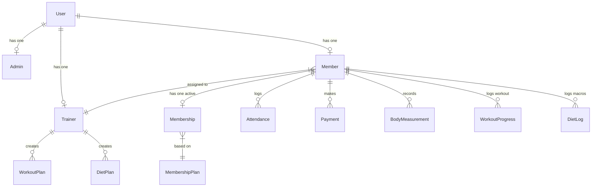

# Project Requirements Document - System Architecture & Security

## 1. Module Overview & Objectives
This document defines the system architecture, authentication workflows, database schema, route structure, and security configurations for the Gym Membership Management System.

The primary objectives are to:
- Establish a secure, role-based backend API using Express.js.
- Define a scalable database schema using Prisma ORM and Supabase PostgreSQL.
- Detail Next.js 15 routing structures and route authorization checks.
- Outline the glassmorphic design system specifications to ensure visual consistency.

---

## 2. Technology Stack Details
- **Frontend**:
  - Next.js 15 (App Router framework)
  - React, TypeScript, and Tailwind CSS
  - UI Components: `shadcn/ui`
  - Animations: `Framer Motion`
  - Charts: `Recharts`
- **Backend API**:
  - Node.js & Express.js
  - Database Interface: Prisma ORM client
- **Database**:
  - Supabase PostgreSQL database
- **Storage**:
  - Supabase Storage buckets (profile photos, ID proofs)
- **Authentication**:
  - JSON Web Tokens (JWT)
- **Notifications**:
  - Firebase Cloud Messaging (push alerts)

---

## 3. Database Schema Overview
The system uses Prisma ORM to interact with Supabase PostgreSQL. Refer to [design.md](file:///c:/Users/HP/Downloads/full%20stack%20application/design.md#L220-L530) for the complete database models, fields, and enum declarations (`UserRole`, `Gender`, `PaymentStatus`, `PaymentMethod`, `PlanDuration`, `MembershipStatus`).

### Key Schema Relations


---

## 4. Authentication & RBAC Middleware

### 4.1 Authentication Flow
1. **Login Request**: User submits credentials to `POST /api/auth/login`.
2. **Verification**: Backend validates the email and checks the password hash using `bcrypt`.
3. **Token Issuance**: Generates a JWT token containing user details (`id`, `email`, `role`).
4. **Sub-profile Lookup**: Returns the user role and profile details to load the corresponding portal dashboard.

### 4.2 RBAC Middleware (Express.js)
```javascript
const jwt = require('jsonwebtoken');

const authenticateJWT = (req, res, next) => {
  const authHeader = req.headers.authorization;
  if (!authHeader || !authHeader.startsWith('Bearer ')) {
    return res.status(401).json({ error: 'Access token required' });
  }

  const token = authHeader.split(' ')[1];
  try {
    const decoded = jwt.verify(token, process.env.JWT_SECRET);
    req.user = decoded; // Contains id, email, role
    next();
  } catch (error) {
    return res.status(403).json({ error: 'Invalid or expired token' });
  }
};

const requireRole = (allowedRoles) => {
  return (req, res, next) => {
    if (!req.user || !allowedRoles.includes(req.user.role)) {
      return res.status(403).json({ error: 'Permission denied' });
    }
    next();
  };
};
```

---

## 5. Next.js App Router Structure
The frontend layout organizes dashboards using route groups to separate access permissions:
```
src/app/
├── layout.tsx            # Providers wrapper (Auth, QueryClient, Theme)
├── page.tsx              # Landing page & Portal Selector
├── login/                # Glassmorphic login panel
└── (dashboard)/          # Dashboard shell
    ├── layout.tsx        # Dynamic navigation sidebar based on user role
    ├── admin/            # Super Admin / Branch Admin tools
    ├── trainer/          # Workout, diet, and measurement tools
    └── member/           # Personal tracking and profile widgets
```

---

## 6. Glassmorphic Visual Style Guidelines
To ensure visual consistency, implement the following styling configurations in CSS stylesheet modules or Tailwind configurations:

### 6.1 Base Variables (Obsidian Dark Theme)
```css
:root {
  --background: 240 10% 3.9%;
  --foreground: 0 0% 98%;
  
  /* Glass panel styles */
  --glass-background: rgba(17, 17, 21, 0.6);
  --glass-border: rgba(255, 255, 255, 0.08);
  --glass-border-hover: rgba(255, 255, 255, 0.16);
  --glass-blur: 16px;
  
  /* Neon colors (HSL values) */
  --primary: 263.4 90% 50.4%;          /* Neon Purple */
  --primary-glow: rgba(124, 58, 237, 0.3);
  --secondary: 191.6 91.4% 36.5%;     /* Electric Cyan */
  --secondary-glow: rgba(14, 116, 144, 0.3);
  
  --accent-emerald: 142.1 76.2% 36.3%; /* Success indicator */
  --accent-rose: 346.8 77.2% 49.8%;    /* Alert indicator */
}
```

### 6.2 Glassmorphic Utility Classes
```css
.glass-panel {
  background: var(--glass-background);
  backdrop-filter: blur(var(--glass-blur));
  border: 1px solid var(--glass-border);
  box-shadow: 0 8px 32px 0 rgba(0, 0, 0, 0.37);
  transition: border-color 0.3s ease, box-shadow 0.3s ease;
}

.glass-panel-hover:hover {
  border-color: var(--glass-border-hover);
  box-shadow: 0 12px 40px 0 rgba(0, 0, 0, 0.5), 0 0 15px var(--primary-glow);
}
```

---

## 7. Security Auditing & Operations
- **Protected API Routes**: All routes under `/api/admin`, `/api/trainer`, and `/api/fitness` are protected by JWT verification.
- **SQL Injection Prevention**: Prisma ORM executes parametrized queries by default to prevent SQL injection.
- **Password Hashing**: User passwords are encrypted using `bcrypt` (12 rounds) before being saved.
- **Connection Pooling**: Uses Prisma's `directUrl` configurations to prevent Supabase connection depletion in serverless environments.
- **Supabase Bucket Security Policies**: Supabase storage uses Row Level Security (RLS) rules to prevent unauthorized reads/writes of member IDs and avatars.
